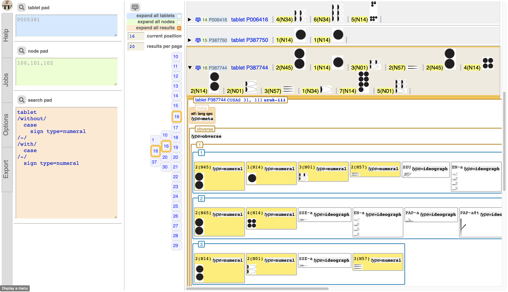

# Uruk

This is a
[Text-Fabric](https://githubv.com/annotation/text-fabric) app
for working with the
[Uruk](https://github.com/Nino-cunei/uruk) corpus: Proto Cuneiform Tablets from the Uruk IV/III period.

Get started with the
[tutorial](https://nbviewer.jupyter.org/github/annotation/tutorials/blob/master/uruk/start.ipynb).

It offers this [API](https://annotation.github.io/text-fabric/Api/App/).

This app also contains interfaces to deal with
[ATF](http://oracc.museum.upenn.edu/doc/help/editinginatf/primer/inlinetutorial/index.html)
transcriptions and
[CDLI](https://cdli.ucla.edu)
photos and lineart.

[Additional API](api.md)

See also
[about](https://github.com/Nino-cunei/uruk/blob/master/docs/about.md),
[images](https://github.com/Nino-cunei/uruk/blob/master/docs/images.md),
[transcription](https://github.com/Nino-cunei/uruk/blob/master/docs/transcription.md).

